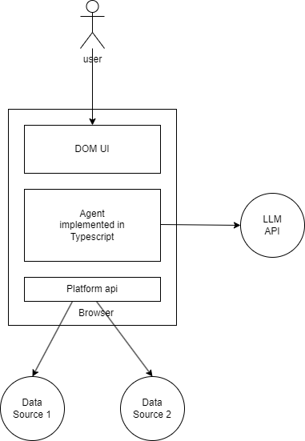

# 一次性软件是什么？

传统的软件的根基是复用。我们总是希望一个软件能够尽可能多的服务于更多的场景更多的受众，从而获得更大的收益，从而支付程序员高昂的工资。

一次性软件的目标是由软件用户本身，按需即时生产。这样可以避免浪费，制造出不被当时需要的功能出来。也能去满足更多的长尾需求。但是这里没有商业利益，没有人愿意投资“让用户自己写软件”这个事情。

但是 LLM 和 agent 可能是个变化。这里有两股力量：

* 硬件厂商希望卖 AI 手机，AI PC 的概念。能够让本地 LLM 做更多有用的事情符合这些硬件厂商的推广诉求。
* 大模型厂商希望卖 API

这些卖模型的供应商提供的是一个更可复用更通用的东西，让用户创作一次性软件去和过去的可复用软件进行 pk。

# 为什么需要 agent？

以聊天形态的 chatgpt 可以满足很多需求了。但是在生产力场景下，需要 chatgpt 去驱动平台 api 调用工具，进行多轮的推理来完成任务。

现在的 llm 能力不行，一个很大原因是单轮推理能够完成的复杂度是受限的。通过拆分成多轮调用，特别是在“按需即时生产”的角度下，工作流程确定的多轮调用。我们更像是自己来拆任务，让LLM当帕鲁来干简单的步骤。场景越明确越特定，我们能帮 LLM 干的事情就越多。

# 一种可能的开发，分发，运行 agent 的形态

有没有可能一个 agent 就是一个跑在浏览器里的单页应用呢？javascript 又不是不能调用 http api。我设想的一次性软件就长这个样子

初期还是面向有写 typescript 能力的用户。以后可以再看看怎么让 LLM 来写这个 typescript，让一次性软件可以被更大的用户群体来创作。这个 agent 由三部分构成

* 面向用户的界面：提供了用户下达需求，以及 debug 执行过程的可视化界面。但是和传统软件 UI 不同，传统的 UI 是要把一堆功能做为可选项呈现出来。但是一次性软件是不需要可变流程的，其本质就是一个一竿子到底的流程函数，或者说脚本。用户只要给一个函数入参就行了，中间就不需要再干预了。也不需要像 unix 命令那样，搞几十个可选参数，因为没必要复用。
* Typescript 实现的流程，调用 LLM API：这里的 LLM 供应商可以是本地 AI 硬件跑的 llama3 8b，也可以是 together.ai 这样的云端供应商提供的 llama3 70b，也可也是 claude3 haiku。这个事情的前提就是随着 llama3 这样的开源大模型的能力变得靠谱，使得我们不用依赖昂贵又难以获得 gpt4 api
* 平台 API 提供额外的数据源：数据除了来源于用户的 UI 输入，来源于大模型的权重内的百科全书，还需要来自于其他的实时获取的数据。比如google检索结果，新闻网页，或者是vscode里的代码仓库的文件。如果只是跑在没有增强的浏览器上，只能用一个受到 CORS 限制的 fetch api。但是如果这个浏览器是内嵌在 vscode 里或者是被油猴脚本给增强过，那么就可以获得更多的数据源。比如可以打开一个新tab页去检索google。

开发这样的 agent 可以是直接在 github.dev 上在线完成的，不需要除了浏览器之外的依赖。调试直接打开 google chrome 的开发者console就可以了。有一个 web ui 看log也比命令行下的日志滚动更友好。

分发可以托管在任意能够托管静态网页的地方。比如 github.io 这样的东西。也可以是微信小程序平台这样的托管小程序的地方。然后给个 url 链接就可以自己用，或者给同事来用了。

运行的时候不需要用户把 api key 填进去，可以是在本地的 AI PC 上跑的本地模型的 API 或者是本地启动的一个中转代理。这样就只需要填一次 api key 就可以跑各种各样的 agent 了。

# llama 3 靠谱吗？

工程上的事情都好说。关键是大语言模型能力的问题。

* llama3 70b 代替 gpt4 问题不大，在公司的项目上亲测可用。groq 的 api 快得可怕
* llama3 8b + 32k 扩展之后的 context 可以对 c++ 代码进行 QA，不仅仅是全文摘要，还包括列举全局状态，以及用 json 格式输出这个状态列表
* claude3 haiku 做翻译，画网页都是刚刚的，便宜得很

上面三个都是很便宜，很容易获取的 llm api。我跑 llama3 8b + 32k context 用什么的设备呢？amd 7900xtx 就可以了。或者 m3 max 系列的 mac。现在的游戏显卡和mac已经能干点除了情感陪伴之外的其他的事情了。如果你对本地大模型还是半年前的玩具印象，是时候重新测一遍，亲自去再评估一下了。

# 还缺一些东西

这个单页应用没啥依赖，现在就能写，打开浏览器就可以开始写。但是要让整个开发，分发，运行的体验更好用还缺一些东西

* 用 typescript 直接写，不需要 node.js webpack 这样的东西来打包。包装一下 babel 就可以解决
* agent 的 ui：需要一个类似 streamlit 那样极简的 web ui
* 分发需要个一键脚本，直接部署到访问比较方便的静态网页托管平台
* vscode 里需要能内嵌浏览器，给 agent 提供增强的平台 api，方便 agent with code repository
* 需要个油猴脚本给 agent 提供 google 搜索和抓取网页内容的能力 api
* 需要一个本地的 ai pc 模型 runner 或者中转代理，让 agent 的使用者不需要每次跑都填 api key
