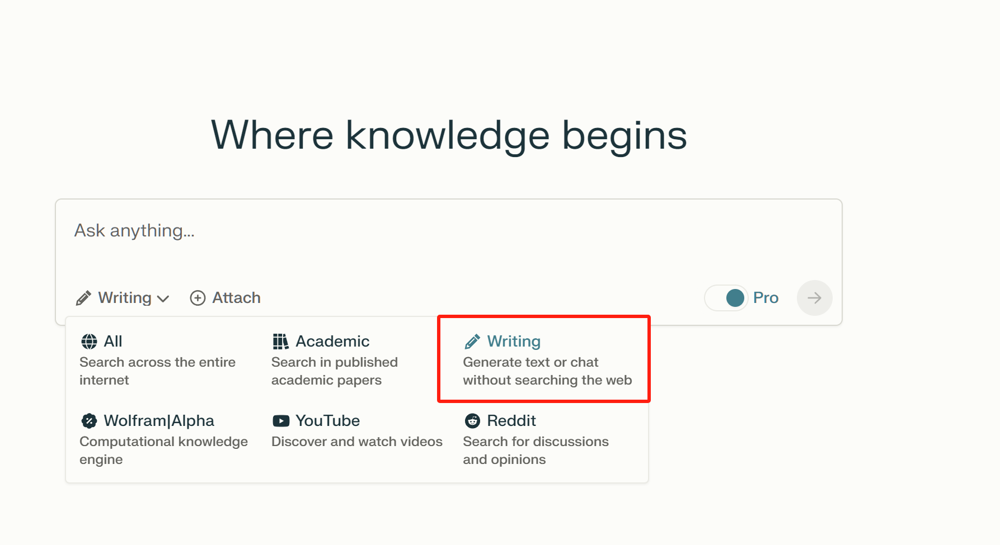
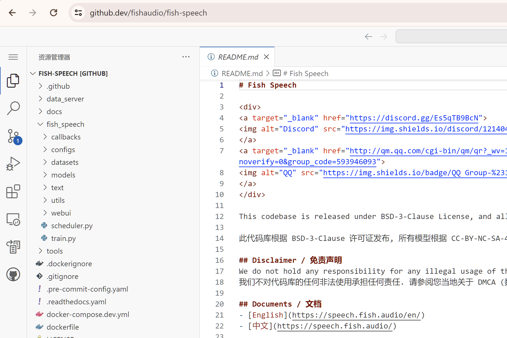
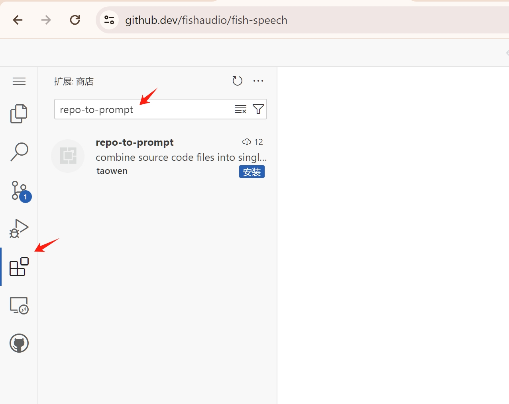
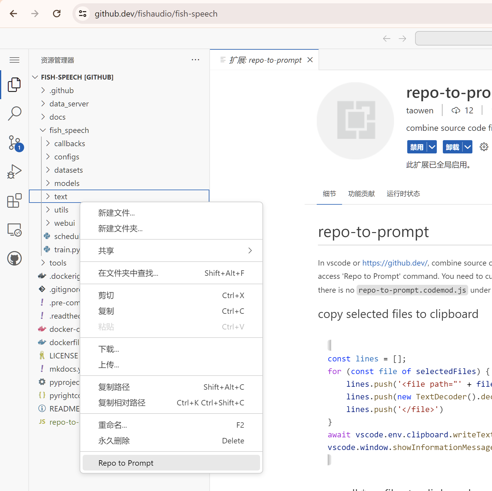
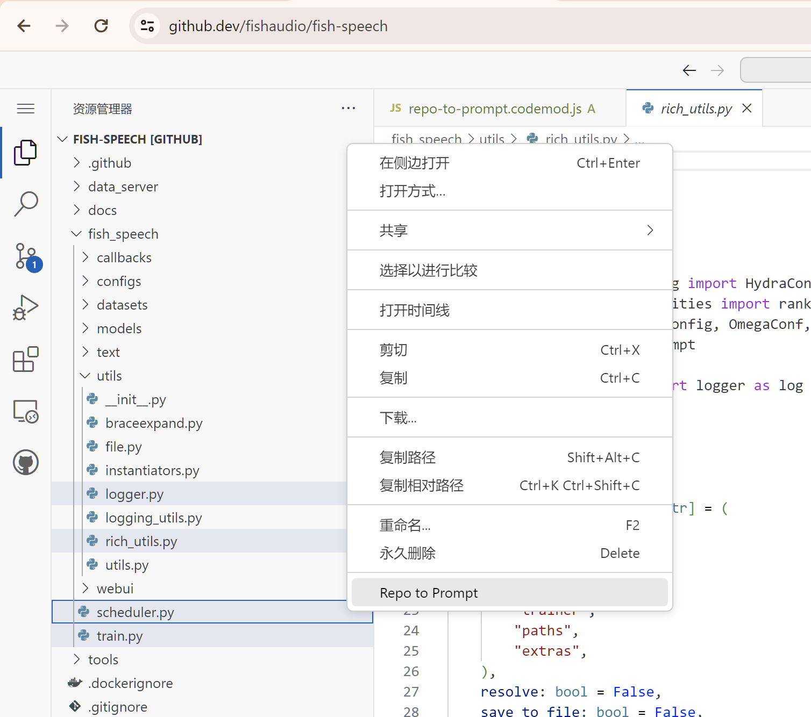
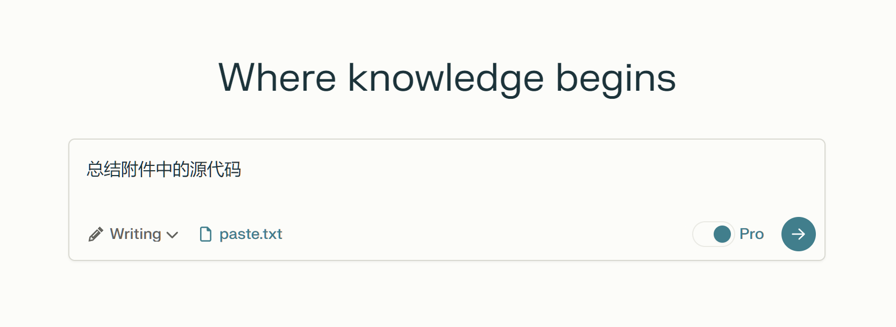

# chat with github 仓库

看不懂开源项目的代码怎么办呢？让 claude 给你讲解。你只要使用这个插件把整个项目复制粘贴给 claude，然后就可以哪里不懂，问哪里啦！
整个过程只需要 chrome 浏览器。不需要本地启动 vscode，也不需要 linux 环境。

## 准备 claude 3

你需要 claude 3 的账号，不需要是 api，任何形式的聊天窗口都可以。我选择的是 https://www.perplexity.ai/ 购买 pro 账号，然后在 settings 中把模型设置为 claude。



使用的时候设置 Focus 为 Writing，这样就不会触发搜索了，也就是和直接访问 claude 3 效果是一样的了。复制粘贴长文本会自动变成附件的形式。也可以用 Attach 按钮手工传 pdf 附件。

## github.dev

然后找一个你想了解的 github 仓库，通过和 claude 聊天来学习这个仓库的源代码。比如 https://github.com/fishaudio/fish-speech 这个仓库。我们只需要把 github.com 改成 github.dev 也就是 https://github.dev/fishaudio/fish-speech 就可以在线打开这个仓库了。搜索和查找引用都可以用，非常方便。



## 安装 repo-to-prompt 插件

点击左边的 extensions 按钮，进入扩展安装界面，搜索 repo-to-prompt



点击安装

## 右键执行 Repo to Prompt

点击左边的 explorer 按钮回到资源管理器界面，在文件树的任意位置右键



第一次执行会在项目的根目录下创建一个 repo-to-prompt.codemod.js 文件。后续右键 Repo to Prompt 都是执行这个 js 文件。

## 定制 repo-to-prompt.codemod.js 的行为

比如说，我们希望把当前资源管理器中选中的文件合并复制到剪贴板

```js
// 修改 repo-to-prompt.codemod.js 写入下面的代码
const lines = [];
for (const file of selectedFiles) {
    lines.push('<file path="' + file.path + '">')
    lines.push(new TextDecoder().decode(await vscode.workspace.fs.readFile(file)))
    lines.push('</file>')
}
await vscode.env.clipboard.writeText(lines.join('\n'))
vscode.window.showInformationMessage('copied to clipboard')
```

## 选中所需的文件，再次右键执行 Repo to Prompt



文本就被复制到剪贴板里了。

```
<file path="/fishaudio/fish-speech/fish_speech/utils/rich_utils.py">
...
</file>
<file path="/fishaudio/fish-speech/fish_speech/utils/logger.py">
...
</file>
<file path="/fishaudio/fish-speech/fish_speech/scheduler.py">
...
</file>
<file path="/fishaudio/fish-speech/fish_speech/train.py">
...
</file>
```

## 粘贴到聊天对话框里



换成 claude.ai 或者 chat.openai.com 的聊天对话框也是一样的，都是复制粘贴。然后把你要问的问题也写在对话框里。

## 高度可定制

repo-to-prompt.codemod.js 可以写任意复杂的代码。有动手能力的朋友，直接在 js 代码中用 fetch 调用 claude 的 api 也是可以的。而且可以访问 vscode 插件 api，可以把 claude 的返回结果直接用来修改源代码，比如生成测试数据，比如做点批量重构什么的。
